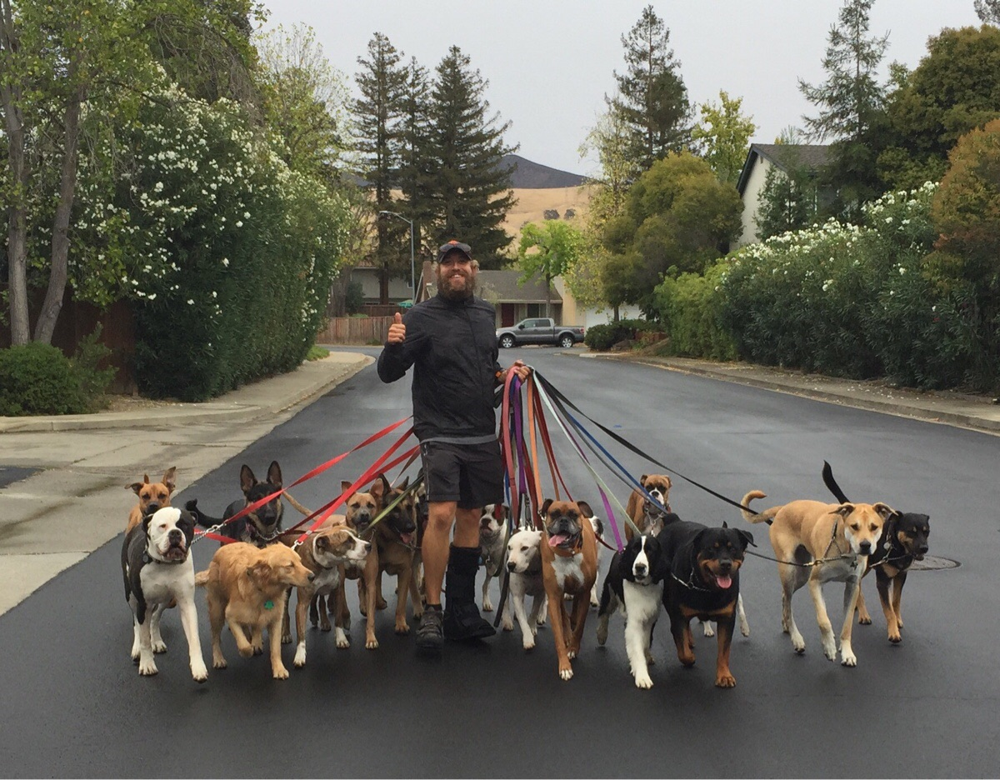

# Challenge BDD

## Objectifs

#### Pour SQL et noSQL

En choisissant le moteur de votre choix pour l'un et l'autre.
SQL : MySQL, PostgreSQL, SQLite...
noSQL : MongoDB, Cassandra, Couchbase...

- Construire un(e) schéma/table de données simples.
- Typer ces données.
- Comprendre la cardinalité et savoir modéliser les 3 grands types de relations entre des schémas de données.
- Créer un serveur local qui permet d'accéder au moteur de base de données choisis.
- Initialiser une connexion à ces bases de données via un ODM pour noSQL et ORM pour SQL.
- Utiliser des requêtes simples type CRUD vers ces données.
- Comprendre les différences de fonctionnement entre les bases de données de type SQL et noSQL.

## Missions

Vous devez créer la base de données d'une application qui permet aux gens de faire du pet-sitting. L'application fonctionnent un peu comme Airbnb.

- Les utilisateurs ont un profil où ils peuvent renseigner une description (username, mail, photo,...) mais aussi des coordonnées bancaire. 
- Il y a deux types de rôles utilisateurs : les sitters et les owners.
- Les sitters proposent un ou plusieurs espaces pour garder les animaux. Les sitters peuvent si ils veulent orner le profil de chaque espace de une ou plusieurs photos. Chaque sitter peut recevoir des commentaires ainsi qu'une note sur son service.
- Les owners ont entre un et plusieurs animaux et peuvent orner le profil de ces animaux de une ou plusieurs photos. Chaque animal peut recevoir une note ainsi qu'un commentaire sur son caractère.
- Au cours d'une année, les animaux peuvent être gardés dans plusieurs espaces, et les espaces peuvent recevoir plusieurs animaux. Le service propose donc un système de réservation.
- Une réservation contient **au moins** un timestamp de début, un timestamp de fin et un système qui permet de suivre son status (pending, accepted, refused,...)

Points d'attention :
- Doit-on créer deux schémas séparés pour les deux types d'utilisateurs. Pourquoi ?
- Doit-on créer deux schémas séparés pour les deux types de *propriétés* (espace et animaux). Pourquoi ?
- En SQL,  les réservations représentent-elles une table de jointure ?

## Aller plus loin

- Définir les besoins pour votre projet.
- Créer vos schémas/tables de données.

